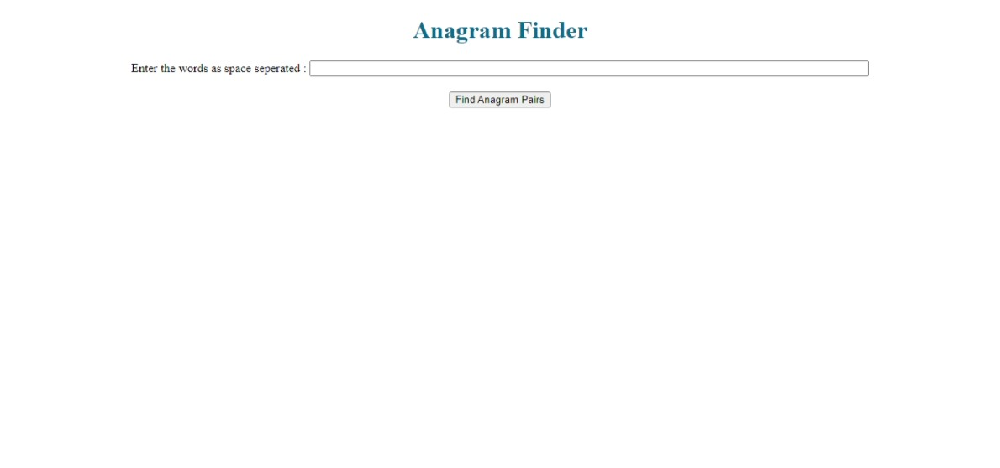
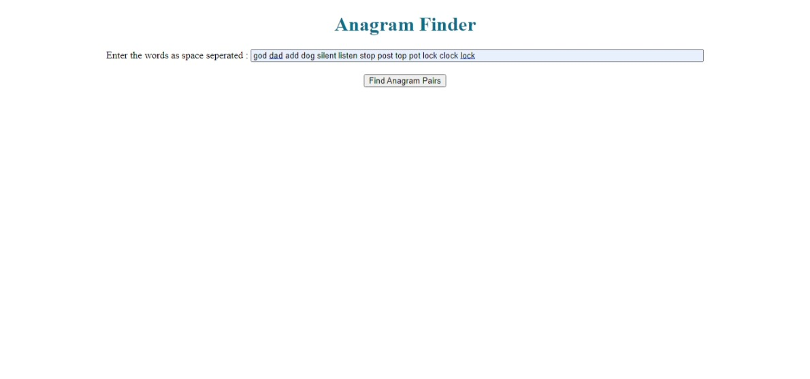
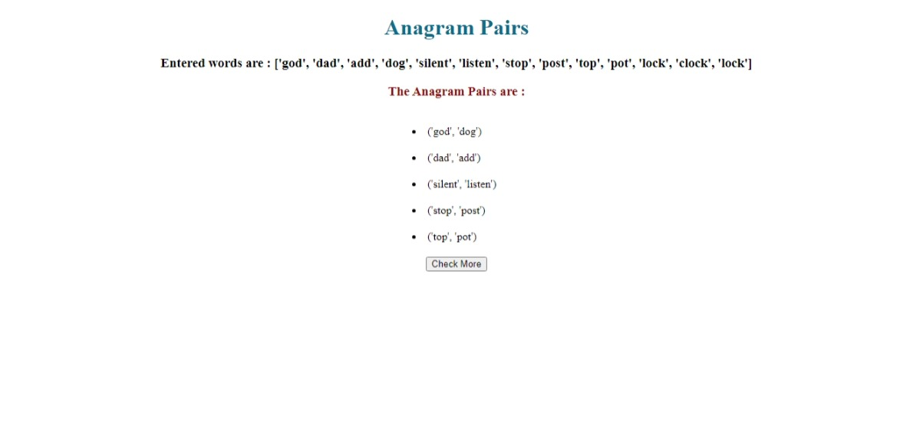

<h1>This was a simple coding test to find Anagram Pairs from a list of words</h1>

<h2>Images</h2>

     
     
    

Note : An anagram is a word or phrase that's formed by rearranging the letters of another word or phrase.

